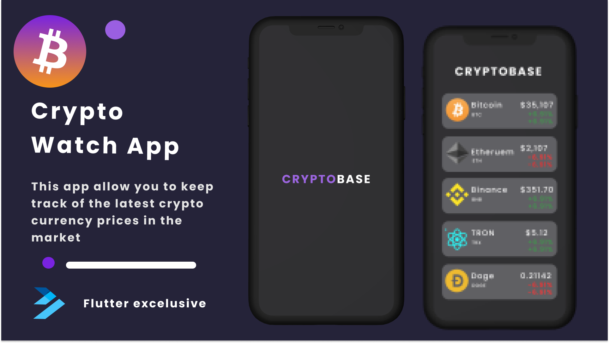

 # CryptoWatch - Flutter Application
 Cryptowatch is an android  application that fetches latest details about the cryptocurrency market from coingecko API. The application displays the most viewd crypto coins in the market.
 
 I created this repository for a few reasons:
 1. To learn the approch of implementing clean architecture and [SOLID principles](https://en.wikipedia.org/wiki/SOLID#:~:text=The%20SOLID%20concepts%20are%3A,%2C%20but%20closed%20for%20modification.%22) in an android app.
 2. To learn libraries/tools supported by Google and most of the android development communities.
 3. To experiment and interact with API request.
 4. Demonstrate best developement practices by utilizing up to date tech-stack .

 ## Table of Contents

- [Prerequisite](#prerequisite)
- [Plugins](#plugins)
- [Related Posts](#related-posts)
- [Screenshots](#screenshots)

## Prerequisite.
- In order to run the application, you need to [clone]("link_to_clone)/[fork]("link_to_fork) the [Cryptowatch Project]("https://github.com/MartinMugambi/cryptowatch").

- Download the [Flutter Programming Language SDK]("https://flutter.dev/?gclsrc=ds&gclsrc=ds) in your computer.

- Download VS code or Android studio code editor and intregrate the flutter sdk with the code editor

## Plugins.

 1. http: ^0.13.3 - This package contains a set of high-level functions and classes that make it easy to consume HTTP resources. It's multi-platform, and supports mobile, desktop, and the browser.
 
 2. get_it: This is a simple Service Locator for Dart and Flutter projects with some additional goodies highly inspired by Splat. It can be used instead of InheritedWidget or Provider to access objects e.g. from your UI.
 
 ## Related Posts.
 
 ## Screenshots.

  
